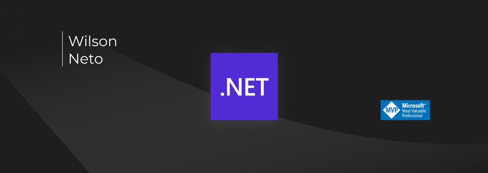

# Hi there, I'm [Wilson Neto](https://www.linkedin.com/in/wilsonnetobr/) 👋

    
    

I'm a software engineer, crafting software solutions since 2010. I have a passion for software engineering, innovation, and technology; I strive to learn something new every day. 

- :rocket: `It's not just about technology and code, but more importantly, it's about helping people`
- :purple_heart: My expertise lies in Software Engineering and System Design, mainly on the backend, APIs and cloud
- :books: Lifelong learner
- :pushpin: Based in São Paulo, Brazil
